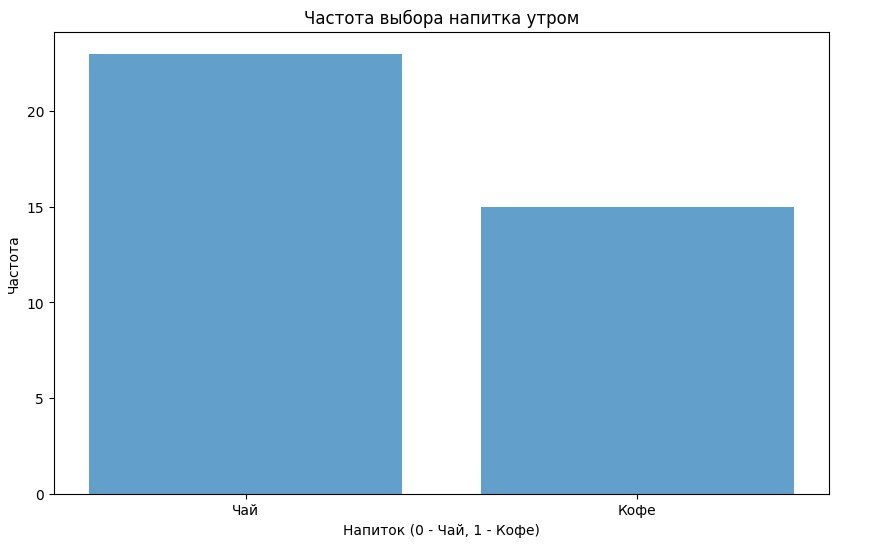
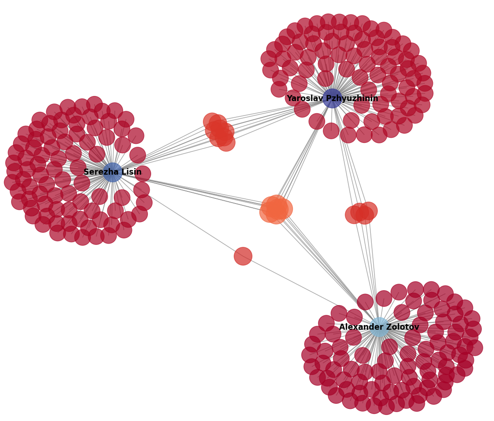
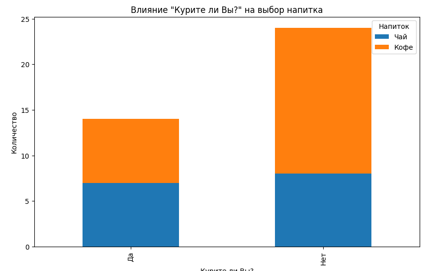
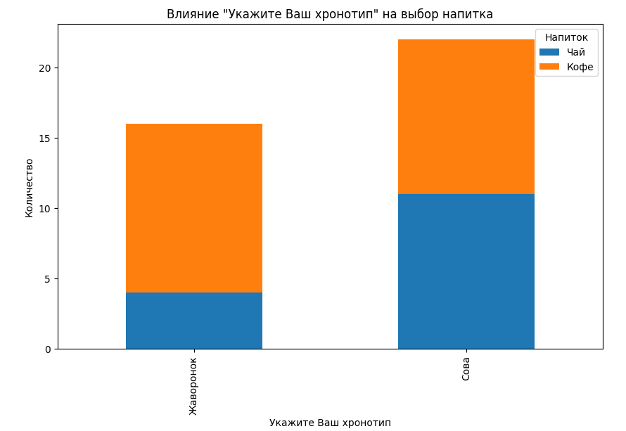
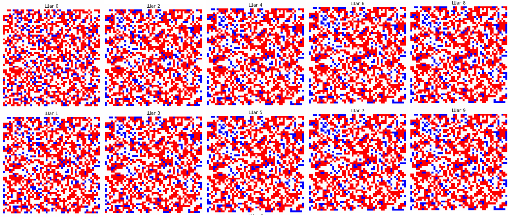

# Python-ractices
These are the python practices that I performed in the process of self-study and training.

# Проект: Анализ предпочтений напитков и прогнозирование на основе опроса(MAIN)
## Описание проекта

Этот проект представляет собой систему, которая анализирует данные опроса с целью предсказать, какой напиток (чай или кофе) предпочитает респондент. Данные собираются через анкетирование, и на основе нескольких факторов, таких как возраст, пол, наличие кофейни поблизости и другие, с помощью алгоритма K-Nearest Neighbors (KNN) предсказывается предпочтение человека.

## Основные файлы

- **Результаты-опроса.csv**: Файл с результатами анкетирования респондентов.
- **test_data.csv**: Тестовые данные, содержащие информацию о нескольких респондентах, которые использовались для предсказания предпочтений с помощью модели.
- **KNN.py**: Основной скрипт, содержащий:
  - Алгоритм KNN для прогнозирования.
  - Код предобработки данных, включающий преобразование категориальных признаков в числовые.
  - Функции для анализа данных и визуализации влияния различных факторов на выбор напитка.

## Используемые технологии

- **Python**: Основной язык программирования для анализа и обработки данных.
- **Pandas**: Библиотека для работы с данными, загрузки и предобработки.
- **NumPy**: Используется для математических операций.
- **Matplotlib**: Библиотека для построения графиков и визуализации данных.
- **K-Nearest Neighbors (KNN)**: Алгоритм машинного обучения для классификации, используемый для прогнозирования предпочтений напитков.

## Описание задачи

Проект включает в себя следующие шаги:

1. **Сбор данных**: Данные были собраны через анкетирование, включающее такие вопросы, как "Вы курите?", "Какой Ваш хронотип?", "Вы являетесь гурманом?" и т.д.
2. **Предобработка данных**: Категориальные значения, такие как "Мужчина"/"Женщина", "Да"/"Нет" и другие, были преобразованы в числовые значения для использования в модели KNN.
3. **Обучение модели**: Обучение модели KNN на предоставленных данных с целью прогнозирования предпочтений напитков.
4. **Тестирование**: Прогнозирование предпочтений на основе новых тестовых данных.
5. **Анализ факторов**: Построение гистограмм для анализа влияния различных факторов на предпочтения напитков.
6. **Визуализация**: В проекте были созданы гистограммы для визуализации влияния факторов на выбор напитка. Это помогает лучше понять, какие факторы чаще всего влияют на предпочтение между чаем и кофе.

## Как запустить проект

1. Склонируйте репозиторий:
   ```bash
   git clone https://github.com/zol-krap-lis/pr-1.git
   ```
2. Установите необходимые зависимости:
   ```bash
   pip install numpy pandas matplotlib
   ```
3. Запустите скрипт `KNN.py` для обучения модели и визуализации данных.

## Примеры использования

- **Предсказание предпочтений**: На основе тестовых данных система предсказывает, какой напиток предпочтёт респондент — чай или кофе.
- **Анализ факторов**: Визуализация показывает, как такие факторы, как курение, хронотип, наличие кофейни рядом и другие влияют на выбор напитка.

## Заключение

Проект демонстрирует использование методов машинного обучения и анализа данных для понимания человеческих предпочтений. Он может быть расширен, чтобы включать дополнительные факторы, усложнять модель, улучшать точность прогнозирования или использовать другие алгоритмы.

### Визуализация результатов
Визуализация показывает, как такие факторы, как курение, хронотип, наличие кофейни рядом и другие влияют на выбор напитка.

- **Частота выбора напитка утром**:
  


# VK Friends Centrality Graph(PRAK2)

Этот проект использует VK API для сбора информации о друзьях и их связях и строит граф с оценкой центральностей узлов (пользователей). Визуализация показывает структуру социальной сети, выделяя ключевых пользователей на основе различных показателей центральности.

## Описание

Код выполняет следующие шаги:

1. **Получение данных пользователей VK**: Идентифицирует пользователей по никнеймам, используя VK API.
2. **Сбор списка друзей**: Собирает список друзей для каждого пользователя.
3. **Построение графа**: Создаёт граф, где узлы — это пользователи, а рёбра — связи (дружба) между ними.
4. **Оценка центральностей**:
   - **Eigenvector Centrality**: Вычисляет влияние пользователя на основе его связей.
   - **Closeness Centrality**: Показывает, насколько близок пользователь ко всем остальным в сети.
   - **Betweenness Centrality**: Определяет, через каких пользователей проходят основные пути между другими пользователями.
5. **Визуализация графа**: Отображает граф с цветами узлов, которые зависят от их центральности.

## Установка

Для работы кода необходим Python с установленными библиотеками:

```bash
pip install requests networkx matplotlib
```

## Пример



- **Влияние курения на выбор напитка**:
  

- **Влияние хронотипа на выбор напитка**:
  


# Модель сегрегации Шеллинга(PRAK3)

Этот проект реализует модель сегрегации Шеллинга с визуализацией процесса на каждом шаге. Код может быть запущен как локально в Python, так и в Google Colab.

## Описание

Модель сегрегации Шеллинга — это простая модель, которая иллюстрирует, как могут формироваться разделенные по признаку группы, даже если начальные предпочтения индивидов по соседям умеренные. В этой реализации мы имеем сетку, где каждая клетка может быть синей, красной или пустой. 

### Основные правила:
- **Сетка**: `n x n` с 45% синих клеток, 45% красных клеток и 10% пустых клеток.
- **Счастливые клетки**: Клетка "счастлива", если у неё есть 2 или более соседей одного цвета.
- **Моделирование**: Несчастливые клетки перемещаются на случайные пустые места до тех пор, пока все клетки не станут счастливы.

## Установка зависимостей

Для работы программы требуется Python и библиотека Matplotlib. Вы можете установить зависимости с помощью следующей команды:

```bash
pip install matplotlib
```

## Структура проекта

- `schelling_model.py`: основной файл с реализацией модели сегрегации Шеллинга.
- `README.md`: файл с инструкциями по использованию.

## Запуск программы

### 1. Локально в Python

1. Скачайте файл `schelling_model.py`.
2. Запустите файл командой:

   ```bash
   python schelling_model.py
   ```

3. Программа будет показывать сетку на каждом шаге моделирования. Если вы запускаете на сервере без интерфейса, изображения будут сохраняться автоматически.

### 2. В Google Colab

1. Загрузите `schelling_model.py` в вашу Google Colab среду.
2. Импортируйте и запустите функцию `run_simulation` из файла:

   ```python
   from schelling_model import run_simulation
   run_simulation(10)  # где 10 — количество шагов
   ```

## Пример

Каждый шаг иллюстрирует процесс сегрегации: синие и красные клетки перемещаются в пустые места, пока не будет достигнуто состояние, при котором все клетки удовлетворены своим положением.


## Параметры

- `n`: размер сетки, по умолчанию `50`.
- `blue_ratio`, `red_ratio`, `empty_ratio`: доли синих, красных и пустых клеток, которые можно изменять для тестирования разных сценариев.
- `num_steps`: количество шагов моделирования, по умолчанию `10`.

## Технические детали

### Определение среды исполнения

Код автоматически определяет, выполняется ли он в Google Colab или локально в Python, используя функцию `is_running_in_colab()`. В зависимости от этого, выбирается подходящий backend для Matplotlib:
- **Colab**: использует `module://matplotlib_inline.backend_inline`.
- **Локально**: если графический интерфейс доступен, используется `Qt5Agg` или `TkAgg`; иначе — `Agg`, который сохраняет изображения вместо отображения.

### Основные функции

- **initialize_grid**: создает сетку с заданными пропорциями синих, красных и пустых клеток.
- **is_happy**: проверяет, счастлива ли клетка, имея не менее 2 соседей одного цвета.
- **step**: выполняет один шаг моделирования, перемещая несчастливые клетки в случайные пустые места.
- **plot_grid**: отображает текущее состояние сетки.

